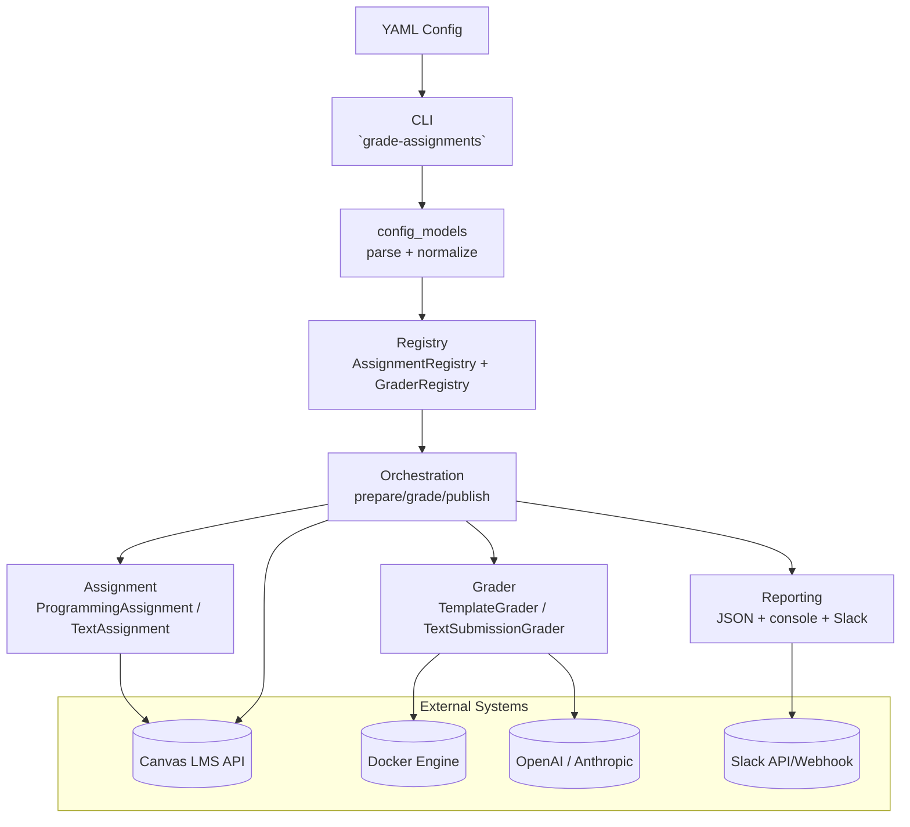

# Architecture Overview

This diagram shows the core control/data flow for a grading run and how major components interact.

## Notes

- `config_models` validates top-level schema and grader settings before work begins.
- Registry lookup enforces grader/kind compatibility and dispatches grader-specific settings normalization.
- Programming grading depends on Docker; text grading can call LLM providers.
- Publish/finalize writes grades/feedback back to Canvas and emits run-level reporting.
